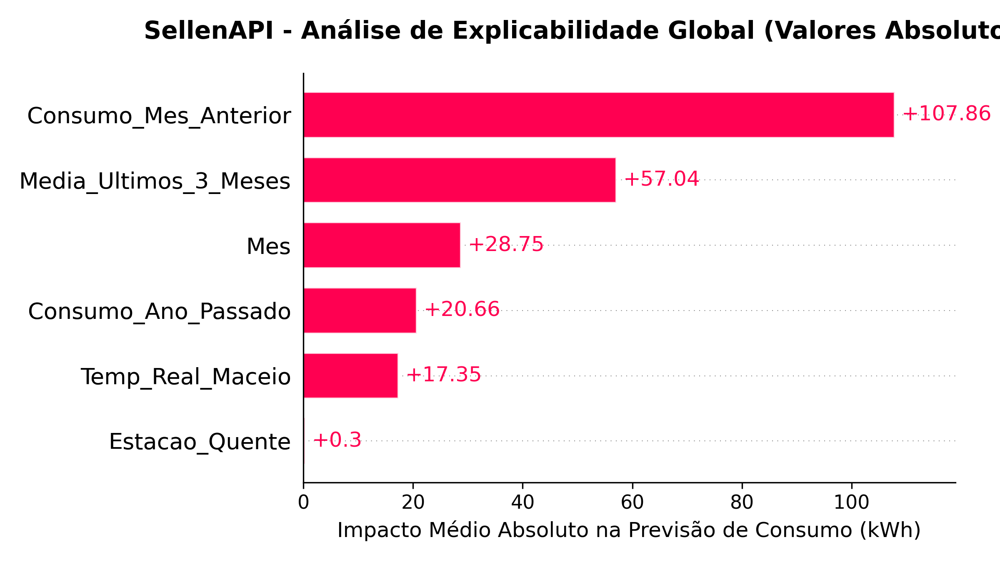

# SellenAPI

API para previsão do consumo de energia elétrica residencial utilizando **Machine Learning**, histórico de consumo de contas da Equatorial (Única empresa se distribuição de enrgia em Alagoas) e dados climáticos da **NASA POWER**.

Este projeto foi desenvolvido como requisito do Projeto Integrador da **OxeTech Academy** (AV2).

---

## Tecnologias utilizadas

- FastAPI
- XGBoost
- Pandas
- Scikit-learn
- pdfplumber
- NASA POWER API
- Docker

---

## Funcionalidades

- Extração automática de dados de faturas em PDFs da Equatorial.
- Consulta de dados climáticos da NASA POWER.
- Previsão do consumo de energia do próximo mês.
- Modelo treinado utilizando XGBoost.
- Execução da aplicação via Docker.

---

## Modelo de Machine Learning

O modelo foi treinado utilizando o algoritmo **XGBoost Regressor**.

Durante o desenvolvimento foram realizados:

- aumento da base de treinamento por meio de *data augmentation*;
- comparação com um modelo de baseline;
- avaliação utilizando a métrica **MAE (Mean Absolute Error)**;
- otimização de hiperparâmetros.

O modelo final apresentou uma redução de aproximadamente **33% no MAE** em relação ao baseline.

---

### Explicabilidade da IA (SHAP)
Abaixo, a analise do impacto das variaveis na tomada de decisão do modelo:



---

## Como executar com Docker

Clone o repositório:

```bash
git clone https://github.com/PipoCaio/SellenAPI.git
cd SellenAPI
```

Crie a imagem:

```bash
docker build -t sellen-api .
```

Execute o container:

```bash
docker run -d -p 8000:8000 --name sellen-api sellen-api
```

Após iniciar a aplicação, acesse:

```
http://localhost:8000/docs
```

A documentação interativa da API estará disponível no Swagger.

---

## Estrutura do projeto

```
SellenAPI/
│
├── main.py
├── requirements.txt
├── Dockerfile
├── README.md
└── xgboost_otimizado.json
```

---

## Autor
https://github.com/PipoCaio